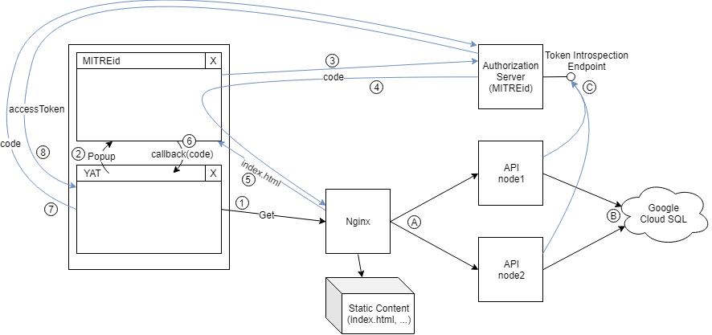

# YAT

This repository contains the implementation of YAT (Yet Another Trello).
YAT is a web application that allows users to create projects in which they are able to manage specific sets of issues and add labels and comments. Additionally, the user can define a transitional graph for newly formed states and set the current state for an issue.

This web application consists of a Spring backend for managing the relational database (PostgreSQL) and the application logic, as well as a web application written in ReactJs.

This project was developed in Desenvolvimento de Aplicações Web (Development of Web Applications) subject in [ISEL](https://www.isel.pt) during my degree in Computer Science and Computer Engineering.

## Diagram

The architecture is composed by four machines and the database hosted on Google Cloud Platform.

There is a machine hosting a Nginx server which will be serving static content and load balancing the API requests into other two machines (Resource Servers - RS). These machines are hosting a Spring Boot application that access the DB for storing and retrieving data.

When a client first accesses the webapp he/she will need to signin via the Authorization Server (AS) which is hosting a MITREid server through Tomcat. Then the webapp will receive an OAuth2.0 code which will exchange for the Access Token (AT) and other user information with the AS. This AT will be used for future requests to the API via the Nginx load balancer. Those RSs will acquire the user information through the Token Introspection Endpoint exposed by the AS.

### Steps

1. Access the webapp and transfer the resources such as `index.html`, `main.js`, `favicon.ico`, ...
2. When pressing the signin button a popup will be presented to the user pointing to the MITREid server;
3. The user then authenticates towards the MITREid and gives permission on his resources for the YAT app;
4. Then the AS will respond with a redirect to the YAT server containing a code on the query string;
5. The `index.html` is sent;
6. When the `main.js` loads the callback will be called and the code is passed into the first window closing the popup;
7. Finally the app will exchange (via back-channel) the code for Access Token (AT) and other user information with the AS.
8. Now that the app has the AT it can request content from the API, attaching the AT on every request.

### Interactions

A. The Nginx server interacts with the APIs to retrieve the data, this requests are load balanced between all nodes.

B. The APIs will interact with the Cloud SQL Dabatase reading and writting data.

C. The APIs will acquire user information based on the AT provided via the Token Introspection Endpoint.

## Learning objectives

* Spring
* ReactJS
* OAuth 2.0
* Hypermedia
* HATEOAS
* Load Balancing (Reverse Proxy)
* Cloud Deployment
* [Google Cloud Platform](https://cloud.google.com)

## Technologies used

* Kotlin
* Gradle
* Spring Boot
* OAuth 2.0
* PostgreSQL
* Nginx (Reverse Proxy)
* ReactJS
* ProblemJson
* SIREN
* HAL
* Hypermedia
* HATEOAS
* GCP
* GCP Cloud SQL Dabatase
* MITREid

## Authors

This project was developed with [Cláudio Bartolomeu](https://github.com/cbartolomeu) and [Marco Martins](https://github.com/marcomartins1998).